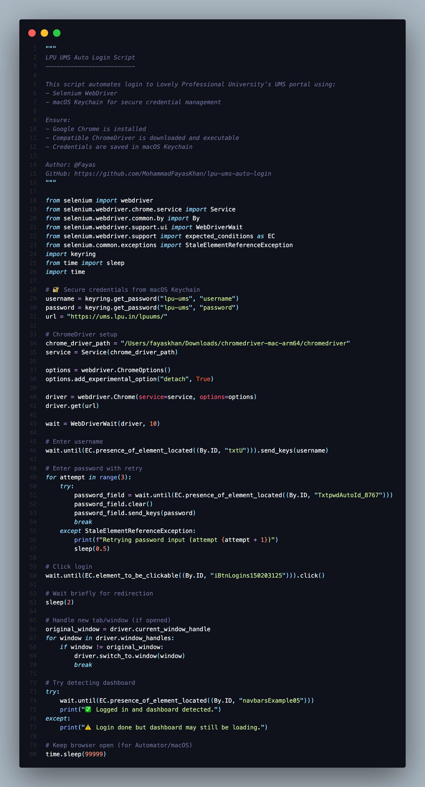
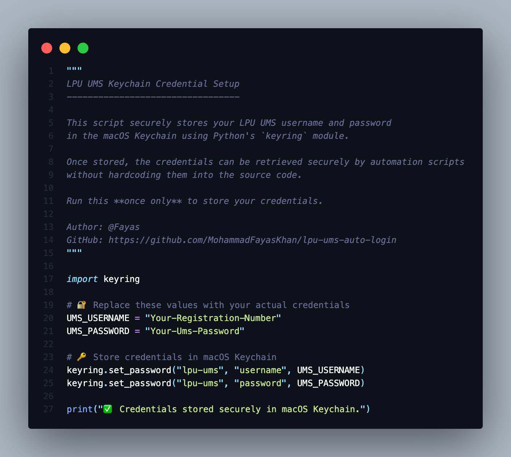

# 🔐 LPU UMS Auto-Login Bot

A Python-based automation script that securely logs you into [Lovely Professional University's UMS](https://ums.lpu.in/lpuums/) using Selenium and the macOS Keychain. This tool is helpful for automating repetitive login processes and serves as a base for future automation workflows like attendance scraping, timetable alerts, and more.


---

## 📦 Features

- ✅ Auto-login to LPU UMS portal  
- 🔐 Secure credential storage using macOS Keychain  
- 🌀 Retry mechanism for unstable page loads  
- 🧠 Clean and readable code, ideal for showcasing on GitHub or LinkedIn  
- 📌 Keeps browser open for inspection/debugging  

---

## 📁 Project Structure

lpu-ums-auto-login/
├── lpu_ums_login.py               # Main auto-login automation script
├── setup_credentials.py       # Stores your credentials securely in Keychain
└── README.md                  # This documentation file

---

## 🛠️ Requirements

- macOS (for Keychain access)
- Python 3.10+
- Google Chrome
- ChromeDriver (version must match Chrome version)

### 🔧 Install Required Python Packages

```bash
pip install selenium keyring
```


⸻

🔐 Step 1: Setup Credentials

Run this script once to securely store your credentials in the macOS Keychain:

python3 setup_credentials.py

setup_credentials.py:

import keyring

# Store your credentials in macOS Keychain
keyring.set_password("lpu-ums", "username", "Your-Registration-Number")
keyring.set_password("lpu-ums", "password", "Your-Ums-Password")

print("✅ Credentials stored securely in macOS Keychain.")


⸻

🚀 Step 2: Run the Automation Bot

Once your credentials are stored, run the automation:

python3 lpu_ums_login.py

lpu_ums_login.py handles:
	•	Opening Chrome
	•	Reading credentials securely
	•	Logging into UMS
	•	Waiting for dashboard to load

⸻

🧠 How It Works
	•	Uses keyring to read your username/password from the macOS Keychain
	•	Opens UMS in Chrome using Selenium WebDriver
	•	Waits for all required fields and elements to be interactable
	•	Logs in and confirms success by checking for the dashboard

⸻

📸 Screenshot

Code Snippet:



Code Snippet:



Result Snippet:


⸻

🧪 Tested On
	•	macOS 15 Sonoma
	•	Chrome v124+
	•	ChromeDriver v124+
	•	Python 3.10+
	•	VS Code

⸻

🔐 Security Notice
	•	Passwords are not hardcoded
	•	macOS Keychain is used for secure storage
	•	Code never prints or exposes credentials

⸻

🪪 License

This project is open-source under the MIT License. Feel free to use, share, and build on it.

⸻

💼 Showcasing on LinkedIn

🚀 Just built a Python-based auto-login bot for LPU’s UMS!
🔐 It securely handles credentials using macOS Keychain and automates login via Selenium.
🧠 All code is open-source and cleanly documented.
👉 Check it out: github.com/yourusername/lpu-ums-auto-login

⸻

🤝 Contributing

If you’d like to improve this or port it to Windows/Linux, feel free to open a PR or issue!

⸻

📬 Contact

Fayas Khan
📧 [fayaskhanmohammad@gmail.com]	🌐 https://www.linkedin.com/in/mohammadfayaskhan/	📦 https://github.com/MohammadFayasKhan

⸻
